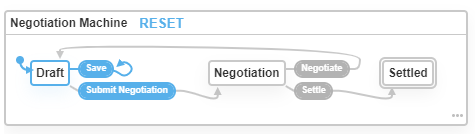

# XState-Negotiation
An not overly complex application which simulates a negotiation process, while displaying available actions, using XState and React.

# Usage
- clone the repository `git clone https://github.com/antonio-marasescu/xstate-negotiation`
- run `npm i` to install dependencies
- use `npm start`

# Acknowledgments
- XState: https://xstate.js.org
- XState Visualizer: https://xstate.js.org/viz/
